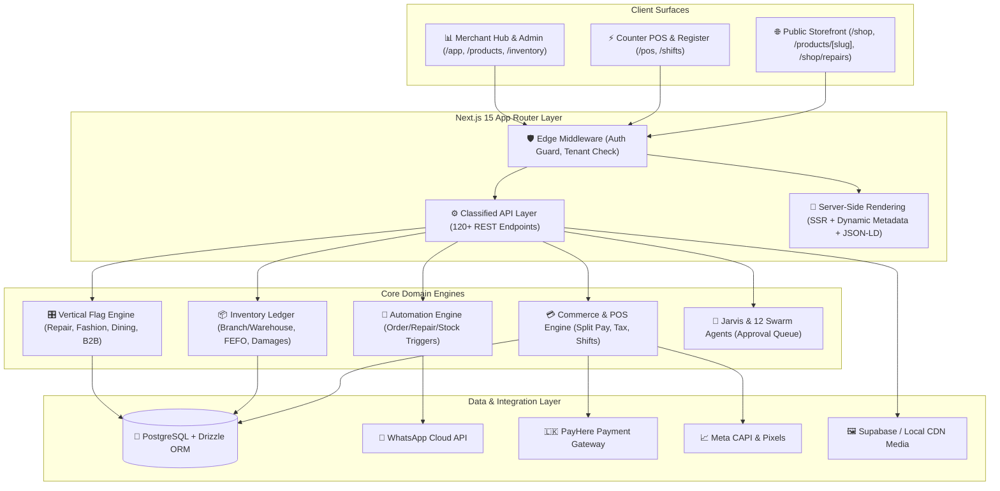

# Grabber Business OS — Architectural Overview

**Grabber Business OS (Grabber POZ Solo)** is a high-performance, single-tenant **Business Operating System (BOS)** and **Omnichannel Retail & POS Engine**. It is architected for physical retail counters, warehouse supply chains, public e-commerce storefronts, and specialized industry verticals (Mobile Repair, Fashion, Restaurant, Wholesale, and Electronics).

---

## 1. High-Level System Architecture



---

## 2. Core Architectural Pillars

### A. Dual Surface Architecture
1. **Public Customer Storefront (`/shop`, `/products/[slug]`, `/categories/[slug]`, `/shop/repairs/*`):**
   - High-speed SSR with dynamic OpenGraph and `Product` / `CollectionPage` JSON-LD for maximum SEO.
   - Live category filter pills, real-time catalog search, and sorting.
   - Sliding cart drawer, persistent local storage cart, and direct COD / WhatsApp / PayHere checkout.
2. **Staff & Merchant Backoffice (`/app`, `/pos`, `/products`, `/inventory`, `/shifts`, `/repairs`):**
   - Mesh-themed responsive interface designed for touchscreens, desktop terminals, and barcode scanners.
   - Protected by role-based staff authentication and PIN access.

---

### B. Single-Tenant Isolation & Authentication
- **Isolation:** Designed as an independent, single-tenant deployment instance per business, guaranteeing complete data sovereignty, zero multi-tenant leakage, and isolated ledger databases.
- **Session Layer (`src/lib/auth/session.ts`):**
  - **Staff JWTs:** Signed with deterministic fallback secrets, preventing edge lockout during deployments.
  - **Role & Capability Checks:** Enforces `assertCanMutateCommerce()` on all destructive operations (e.g., bulk deletes, stock adjustments, voided orders).
  - **Shopper Sessions:** Lightweight customer JWT for online order history and live repair ticket tracking.

---

### C. Data & Schema Architecture (`src/db/schema.ts`)
Built on **PostgreSQL** with type-safe schema definitions via **Drizzle ORM**:
- **Double-Entry & Relational Integrity:** Explicit foreign keys with cascading constraints.
- **Stock Balances (`stockBalances`):** Unique multi-column index `(locationType, locationId, productId, variantId)` ensuring atomic stock isolation across retail branches and centralized warehouses.
- **Product Matrix:** Strict parent-child relationship between base `products` and `productVariants` (Size × Color matrix, custom barcodes, and individual wholesale pricing).
- **Audit Logging & Serial Lifecycle:** Tracks IMEI numbers, warranty periods, and return line items.

---

## 3. Subsystems & Domain Engines

```
┌────────────────────────────────────────────────────────────────────────┐
│                        GRABBER DOMAIN ENGINES                          │
├──────────────────┬──────────────────┬──────────────────┬───────────────┤
│    COMMERCE      │    INVENTORY     │    VERTICALS     │  AI & AGENTS  │
├──────────────────┼──────────────────┼──────────────────┼───────────────┤
│ • POS Register   │ • Branch/WH      │ • Mobile Repairs │ • Jarvis DB   │
│ • Shift Float    │ • Stock Ledger   │ • Fashion Matrix │ • 12 Agents   │
│ • Split Payment  │ • Bulk CSV Import│ • Restaurant KDS │ • Approval CTR│
│ • LKR VAT / NBT  │ • Damages/Waste  │ • B2B Wholesale  │ • FAL Ad Gen  │
│ • Order State    │ • Media CDN Sync │ • Polim Potha    │ • Auto Rules  │
└──────────────────┴──────────────────┴──────────────────┴───────────────┘
```

### 1. Commerce & Counter POS Engine
- **Live Counter POS (`src/app/pos/page.tsx`):** Barcode scanner listener, quick cart, partial payments (Cash, Card, Credit, QR), customer loyalty lookup, and instant thermal receipt printing.
- **Cash Drawer & Shifts (`src/app/shifts/page.tsx`):** Opening float, mid-shift cash drops, expected vs. actual variance calculations, and Z-report generation.

### 2. Catalog & Bulk Inventory System
- **Product Catalog (`src/app/products/page.tsx`):** 5,000+ SKU scale, multi-select rows, batch category assignment, bulk soft-delete, and "Type & Get" combobox category creation.
- **Media Library & Auto-Align (`src/lib/media/media-service.ts`):** Drag-and-drop batch upload generating public CDN links with automated SKU/name matching.

### 3. Vertical Presets Framework (`src/lib/config/vertical-flags.ts`)
Modular flag system allowing single instances to adapt to specific merchant types:
- **Mobile Repair & Tech:** Diagnostic fees, technician assignment, spare parts ledger consumption, customer tracking portal.
- **Fashion & Apparel:** Size × Color matrix generator, barcode label printing, seasonal collections.
- **Restaurant & Café:** Dining floor layout, table management, Kitchen Display System (`/restaurant/kds`).
- **Wholesale & B2B:** Quotations converted to invoices, wholesale price tiers, and *Polim Potha* (Sri Lankan credit ledger).

### 4. AI Agents & Human-in-the-Loop Safety (`src/lib/agents/`)
- **Jarvis Engine (`src/components/ai/jarvis-drawer.tsx`):** Embedded assistant with direct database read/draft tools.
- **Safety Gate (`src/lib/agents/approval-service.ts`):** Low-risk actions execute automatically; high-risk actions (price updates, bulk deletes, refunds) are held in an `APPROVAL_WAITING` queue until confirmed by a manager in `/approvals`.

---

## 4. Key Architectural Directories

| Directory / File | Description |
|---|---|
| `src/app/api/` | 120+ classified REST endpoints for POS, inventory, orders, verticals, and webhooks. |
| `src/components/storefront/` | Public customer storefront shell, product cards, category navigation, and cart drawers. |
| `src/components/ui/` | Design system primitives (Modals, Fields, Staff Header, Navigation). |
| `src/lib/catalog/` | Product services, bulk operations, CSV import/export engines. |
| `src/lib/auth/` | Edge & Node session verification, cryptographic signing, permission policies. |
| `src/db/schema.ts` | Unified relational PostgreSQL schema and enum definitions. |
| `docs/` | Comprehensive documentation (`ROADMAP.md`, `PRODUCT_AUDIT.md`, `TECHNICAL_HANDOVER_GUIDE.md`). |
