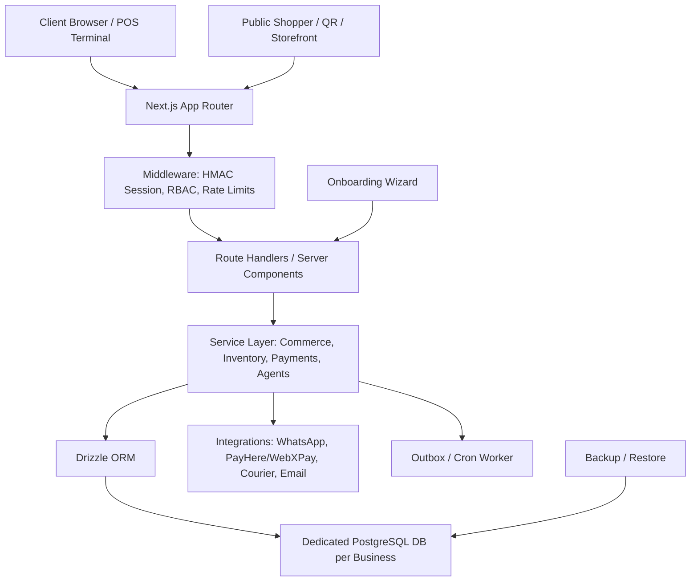

# Final Product Proposal — Grabber / MyPoz Consolidation

**Date:** 2026-09-22

> **Commercial update — 2026-09-23:** Use [`COMMERCIAL_MODEL.md`](./COMMERCIAL_MODEL.md) as the current SSOT. The product is sold as one all-in-one **Grabber Business OS Pro** plan with vertical packs, not as package tiers.

**Reviewed projects:**

- `D:\GRABBER POZ SOLO`
- `D:\GRABBER MYPOZ`
- `D:\MyPoz & Store\grabber-pos`
- `D:\MyPoz & Store` root wrapper/docs

---

## Executive verdict

Build the final commercial product from **`D:\GRABBER POZ SOLO`** and treat the other two projects as **reference/source-mining repositories**, not production bases.

Final product name:

> **Grabber Business OS Pro**

Positioning:

> A dedicated single-business POS, storefront, inventory, accounting, service, and lightweight ERP operating system for Sri Lankan SMEs, deployed as one isolated app + one isolated database per client.

This gives the best win-win:

- **For customers:** simpler pricing, stronger data isolation, less SaaS risk, faster onboarding, and an owner-friendly POS/storefront experience.
- **For Grabber/MyPoz:** lower support burden, easier deployments, clearer security story, reusable vertical packs, and faster paid pilots.

---

## Evidence summary

| Candidate | Architecture | Validation result | Strength | Concern | Verdict |
|---|---|---:|---|---|---|
| `D:\GRABBER POZ SOLO` | Next.js + Drizzle/Postgres, single-business deployment | Typecheck passed, build passed, auth coverage passed, 584/589 tests passed | Most complete ERP/POS/vertical platform | Needs dependency upgrade + timeout cleanup | **Primary base** |
| `D:\GRABBER MYPOZ` | Next.js + Supabase/RLS multi-tenant commerce cloud | Typecheck passed, build passed | Good storefront/HQ/Supabase ideas | Older, smaller test base, multi-tenant complexity | Reference only |
| `D:\MyPoz & Store\grabber-pos` | Next.js 16 + Supabase/RLS commerce cloud | Typecheck passed, 241 tests passed, default build failed OOM | Good WAF/proxy, latest deps, strong tenant storefront ideas | Build instability, path issue with `&`, SaaS complexity | Reference only |
| `D:\MyPoz & Store` root | Wrapper/docs plus nested apps | Not a deployable main app | Useful docs/history | Not final codebase | Archive/reference |

---

## Architecture decision

### Chosen model: dedicated single-business install

Use:

- one app/container per business;
- one PostgreSQL database per business;
- one `AUTH_SECRET`, `MASTER_ENCRYPTION_KEY`, and `CRON_SECRET` per business;
- optional HQ/demo instance as a separate install;
- shared source code and shared Docker image, but never shared customer data.

### Why not multi-tenant SaaS as the first final product?

The MyPoz multi-tenant repos have useful engineering, but multi-tenant SaaS adds hard problems before revenue:

- RLS correctness must be perfect forever;
- custom domains and tenant routing multiply support cases;
- shared DB incidents affect all tenants;
- pricing/support/ops become SaaS-grade too early;
- migrations and failed data imports become riskier.

Solo gives the commercially safer first product: sell, deploy, certify, and support each client as an isolated business system.

### What to reuse from the MyPoz projects

| Source | Reuse |
|---|---|
| `D:\GRABBER MYPOZ` | storefront builder concepts, Supabase/RLS docs, merchant onboarding language, production smoke scripts |
| `D:\MyPoz & Store\grabber-pos` | WAF/proxy patterns, Upstash/distributed rate-limit idea, latest payment gateway patterns, storefront tenant UX ideas |
| `D:\GRABBER POZ SOLO` | final schema, auth model, POS, vertical packs, tests, deployment docs, onboarding wizard, agents, ERP roadmap |

---

## Final product scope

### Product surfaces

1. **Owner/Admin OS**
   - dashboard, setup, branches, staff, settings, reports, integrations, backups.

2. **Counter POS**
   - fast barcode sale, cart, discounts, supervisor PIN, receipt print, cash/card/COD, offline queue.

3. **Inventory & Purchasing**
   - products, variants, barcodes, GRN, transfers, stock-take, damages, returns, serial/IMEI lifecycle.

4. **Storefront**
   - public `/shop`, product/catalog pages, cart, checkout, COD, promotions, reviews/wishlist, tracking.

5. **Customer Operations**
   - customers, loyalty, Polim Potha/credit ledger, warranties, repairs, appointments.

6. **Vertical Packs**
   - retail, grocery/FEFO, mobile repair, restaurant/KDS, salon, pharmacy foundation, rental foundation, auto-parts fitment.

7. **Finance Lite**
   - sales reports, AP, bank accounts, payroll foundation, EPF/ETF exports, e-invoice foundation.

8. **Jarvis / Agents**
   - measure → propose → staff approve → execute; no raw SQL; approval queue for high-risk actions.

9. **Creative / Marketing**
   - social channels, creative factory, WhatsApp messaging, storefront promotion tools.

---

## Final architecture blueprint



### Non-negotiable invariants

- No shared production DB between clients.
- No production demo PIN.
- No production `AUTH_OPTIONAL`.
- No staff API without session/RBAC.
- No payment webhook accepted without configured secret when provider is enabled.
- No stock mutation outside the inventory ledger.
- No agent execution without policy + audit + approval for high-risk tools.
- No go-live unless backup restore is tested.

---

## Hardening backlog before paid rollout

### P0 — must fix before first serious client

1. **Dependency security**
   - Upgrade `next`/`postcss` path carefully and rerun full `npm run check`.
   - Upgrade `vitest` after checking breaking changes.

2. **Test timeouts**
   - Fix or increase deterministic timeout for the 5 slow Solo tests:
     - catalog duplicate SKU validation;
     - sitemap generation;
     - Jarvis approval queue;
     - company lead POST;
     - checkout idempotency red-team test.

3. **Distributed rate limiting**
   - Replace in-memory rate-limit with Redis/Upstash or Postgres-backed counters for production.

4. **Vercel/Coolify migration safety**
   - Do not run DB bootstrap as a normal Vercel build command against production.
   - Run migrations as an explicit release step.

5. **Sentry / logging**
   - Configure `SENTRY_DSN` and release metadata for every production tenant.

6. **Secret rotation**
   - Rotate any secrets that ever appeared in local `.env`, build logs, screenshots, or Coolify incidents.

### P1 — first commercial pilot

1. Finish M7 onboarding wizard to enforce go-live gates.
2. Create one golden demo tenant with real SKUs and real workflows.
3. Certify one vertical deeply before selling many verticals.
4. Add operator dashboard for integration health and failed jobs.
5. Add import templates for products/customers/suppliers.

### P2 — scale

1. Add client provisioning CLI with repeatable DNS/env/DB setup.
2. Add backup schedule monitoring and restore drills.
3. Add role-specific training guides.
4. Add paid plan/license enforcement.
5. Add optional mobile companion only after POS/storefront is stable.

---

## Recommended release plan

### Release 1: Pilot retail/repair tenant

Goal: one paying business can run daily sales.

Ship:

- POS sale + receipt;
- product import;
- inventory stock balance;
- customer ledger;
- COD storefront;
- order tracking;
- returns/damages;
- staff PIN rotation;
- backup export/restore;
- Sentry;
- operator go-live checklist.

Exit criteria:

- `npm run typecheck` passes;
- `npm run build` passes;
- auth coverage passes;
- security/red-team tests pass or documented timeout is fixed;
- restore drill passes;
- 20 real POS transactions reconcile with stock and cash.

### Release 2: Service vertical

Goal: one repair/salon/service business runs appointment/job lifecycle.

Ship:

- repair jobs or appointments;
- warranty claim;
- parts-from-stock;
- customer WhatsApp status updates;
- service invoice;
- daily report.

### Release 3: Restaurant/grocery vertical

Goal: prove deeper inventory logic.

Ship:

- KOT/KDS;
- recipes/BOM;
- grocery FEFO;
- wastage/damage;
- margin report.

---

## Developer guide

### Local setup

```bash
cd "D:\GRABBER POZ SOLO"
npm install
cp .env.example .env.local
npm run env:validate
npm run typecheck
npm test
npm run build
npm run dev
```

### Database workflow

```bash
npm run db:generate
npm run db:migrate
npm run db:test-rls
```

Rules:

- schema changes start in `src/db/schema.ts`;
- migrations go under `drizzle/migrations`;
- never patch production DB manually without capturing SQL in repo;
- every stock/payment/accounting change needs an invariant test.

### Validation workflow

```bash
npm run auth:coverage
npm run env:validate -- --production
npm run check
npm audit --audit-level=moderate
```

If full tests are slow, run targeted suites first:

```bash
npx vitest run tests/security-http-auth.test.ts tests/payment-webhook-security.test.ts
npx vitest run tests/commerce-integrity.test.ts tests/red-team/attack-suite.test.ts
```

---

## Deployment guide

### Per-client environment

Required:

- `NODE_ENV=production`
- `DATABASE_URL`
- `AUTH_SECRET`
- `MASTER_ENCRYPTION_KEY`
- `CRON_SECRET`
- `NEXT_PUBLIC_APP_URL`
- `LANDING_MODE=storefront` for client shops, `company` for HQ/demo

Recommended:

- `SENTRY_DSN`
- `NEXT_PUBLIC_SENTRY_DSN`
- `WHATSAPP_TOKEN`
- `WHATSAPP_PHONE_ID`
- `WHATSAPP_VERIFY_TOKEN`
- `WHATSAPP_APP_SECRET`
- payment gateway secrets only after contract approval.

### Go-live command sequence

```bash
npm run env:validate -- --production
npm run db:migrate
npm run auth:coverage
npm run build
npm run client:certify
npm run ops:smoke
```

### Go-live checklist

- Owner account exists and temporary PIN rotated.
- No demo PIN active.
- Business details, tax, receipt footer, logo configured.
- Branch, warehouse, and opening stock created.
- Product import reconciled.
- Payment mode explicitly enabled or disabled.
- WhatsApp/courier integrations show honest status.
- Backup exported and restored into test DB.
- Sentry receives a test event.
- Staff trained on sale, return, damage, close shift, and restore contact path.

---

## Operator guide

### Daily

- Open shift.
- Confirm printer/scanner.
- Check failed jobs/integration health.
- Reconcile cash drawer.
- Export daily sales summary.

### Weekly

- Run stock-take on top SKUs.
- Review damages/returns.
- Check low-stock and expiry alerts.
- Confirm backups are recent.

### Monthly

- Payroll/statutory exports if enabled.
- Tax/e-invoice report if enabled.
- Rotate staff who left.
- Restore-test one backup.

---

## Commercial guide

### Grabber Business OS Pro package

Sell first as:

- POS + inventory + customer ledger;
- simple storefront + COD;
- product import;
- setup and training;
- monthly support.

Avoid promising:

- certified IRD VAT/PAYE submission;
- card payments without merchant approval;
- fully autonomous AI;
- multi-company group accounting;
- custom mobile app on day one.

### Best first verticals

1. Mobile repair / electronics.
2. Grocery / mini market.
3. Salon / appointments.
4. Restaurant/cafe after KDS pilot.

### Pricing recommendation

- Setup fee for onboarding/import/training.
- Monthly support/license per business.
- Add-ons for WhatsApp, online payments, creative media, advanced verticals, backups/SLA.

---

## Final recommendation

Use **`D:\GRABBER POZ SOLO` as the production trunk**.

Brand the commercial offering as **Grabber Business OS Pro**.

Keep:

- `D:\GRABBER MYPOZ` as **Legacy Multi-Tenant Reference**.
- `D:\MyPoz & Store\grabber-pos` as **SaaS/Storefront/WAF Reference**.
- `D:\MyPoz & Store` root as **Archive and Product Research**.

Do not merge all three directly. Mine the best patterns intentionally, one feature at a time, with tests and migration notes.

---

## First client proposal: ThePartyStore

The first client rollout is now defined as a reusable pilot package for ThePartyStore.

Reference documents:

- Client proposal: `docs/clients/THEPARTYSTORE_PRODUCT_PROPOSAL.md`
- Deployment playbook: `docs/clients/THEPARTYSTORE_ONBOARDING_AND_COOLIFY.md`
- Asset report: `reports/client_assets/thepartystore_asset_report.json`

Recommended next step: deploy ThePartyStore on Coolify using a dedicated app, dedicated database, runtime-only secrets, and persistent image volume at `/app/public/uploads`.
