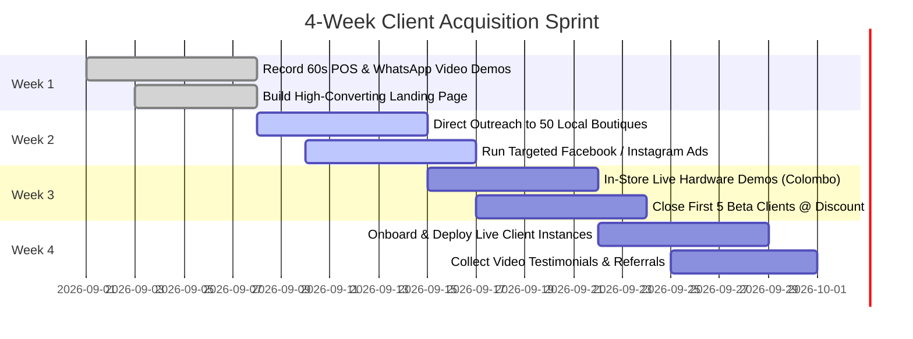

# GRABBER BUSINESS OS — GO-TO-MARKET (GTM) & MARKETING PLAN

---

## 1. Product Positioning & Value Proposition

**Positioning Statement:**
> "Grabber Business OS is the all-in-one Single-Business Operating System built specifically for Sri Lankan retail, fashion, supermarkets, and restaurants — combining high-speed POS, real-time Web Storefront, WhatsApp commerce automation, Polim Potha customer credit recovery, double-entry financials, and an AI Creative Marketing Studio into one unified system with zero monthly SaaS lock-in."

### Key Value Differentiators vs. Generic POS Systems

| Traditional POS (e.g. SalesPlay, Square, Multi-Tenant SaaS) | Grabber Business OS Solo Edition |
| :--- | :--- |
| ❌ Shared multi-tenant database (Data owned by vendor, slow peak hours). | ✅ **100% Dedicated Single-Business Database** (Client owns all data with zero vendor lock-in). |
| ❌ Separate tools needed for Storefront, POS, and WhatsApp. | ✅ **Single Commerce Engine** (One stock pool synced across Counter POS, Web, and WhatsApp). |
| ❌ No local customer credit tracking. | ✅ **Polim Potha AR Subsystem** (Built-in aging analysis, limit enforcement, and WhatsApp payment reminders). |
| ❌ High recurring monthly fees that increase as business scales. | ✅ **Flexible Licensing** (One-time outright purchase OR high-margin managed service). |
| ❌ No marketing tools included. | ✅ **Integrated AI Creative Studio** (Generate video ads, product explainers, and social media reels). |

---

## 2. Target Verticals & Ideal Customer Profiles (ICP)

| Vertical | Primary Pain Points Solved | Killer Features for This Vertical |
| :--- | :--- | :--- |
| **Fashion Boutiques & Apparel** | Size/Color variant chaos, stock sync between store & online Instagram orders. | Size-color variant matrix, barcode sticker generator, Storefront builder with "Order via WhatsApp". |
| **Grocery & Supermarket** | Slow checkout queues, register variance, cash drawer theft. | Sub-second barcode scanner checkout, cash float management, Z-Report settlement slips. |
| **Electronics & Hardware** | Credit sales to trusted clients, supplier payables. | Polim Potha AR aging reports, supplier AP tracking, Goods Receipt Notes (GRN). |
| **Restaurants & Cafes** | Split bills, dine-in vs takeaway orders. | Fast POS tender, Cash/Card/Online split payments, daily register float reconciliation. |
| **Wholesale & Distributors** | High-volume credit limits, multi-warehouse stock. | Inter-warehouse stock transfers, bulk customer credit limits, double-entry General Ledger. |

---

## 3. Commercial Pricing Packages

### Package 1: Starter Launch Package (Single Location)
* **Pricing:** LKR 125,000 (One-time) + LKR 5,000/mo Cloud Hosting & Maintenance.
* **Includes:**
  - 1 Branch POS Register + Web Storefront.
  - Full Product & Inventory Management.
  - Polim Potha Customer Credit Subsystem.
  - Setup & Data Migration (Up to 500 SKUs).
  - Thermal Printer & Barcode Scanner setup.

### Package 2: Business Growth Package (Multi-Location & Creative)
* **Pricing:** LKR 250,000 (One-time) + LKR 10,000/mo Cloud & Support.
* **Includes:**
  - Up to 3 Branches + 1 Central Warehouse.
  - Inter-Location Stock Transfers.
  - Creative Factory & AI Video Studio.
  - Automated WhatsApp Commerce & Receipt Dispatch.
  - Double-Entry General Ledger & P&L Statement.
  - Priority On-Site Training & 24/7 Phone Support.

### Package 3: Enterprise Wholesale Edition
* **Pricing:** LKR 450,000+ (Custom Scope).
* **Includes:**
  - Unlimited Branches & Warehouses.
  - Custom Payment Gateway & Courier API integration.
  - Custom AI Copilot (Jarvis) trained on proprietary supplier catalogs.
  - Dedicated Supabase PostgreSQL Database Cluster.

---

## 4. 4-Week Client Acquisition & Sales Campaign

---

## 5. Sales Pitch Script (30-Second Elevator Pitch)

> *"Hi [Owner Name], are you still running your retail shop on old software where your physical store stock and online WhatsApp orders are disconnected?*
> 
> *We built **Grabber Business OS** — an all-in-one system for Sri Lankan merchants. When you scan a product at your counter, it instantly reserves stock across your online store and WhatsApp. Plus, it automatically tracks your **Polim Potha customer credit** with aging alerts, calculates your **exact daily profits and VAT**, and can even generate **video ads for your products using AI**.*
> 
> *Can I show you a 5-minute live demo on our tablet today?"*
