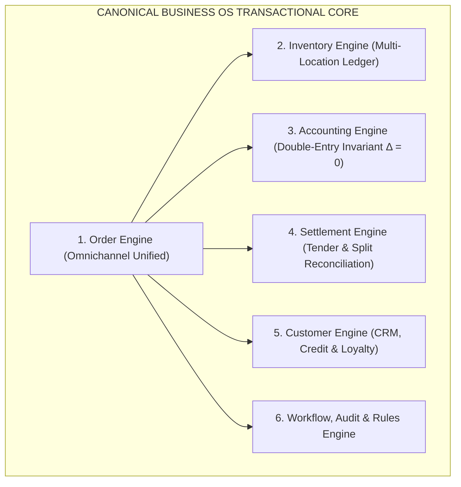

# GRABBER BUSINESS OS — MASTER SYSTEM AUDIT, VERIFICATION & PRODUCTION HARDENING PLAN

**Document Version:** 2.0-ENTERPRISE  
**Target Platform:** Single-Tenant Retail ERP, POS, Omnichannel Commerce & Double-Entry Accounting OS  
**Jurisdiction & Operating Context:** Sri Lanka (LKR Currency, 18% VAT, Polim Potha Micro-Credit, Multi-Branch/Warehouse, WhatsApp-First)  
**Evaluated Repository:** `anasbikes1992-ui/grabber-poz-solo` &bull; **Live App:** `https://grabber-poz-solo.vercel.app`

> **Superseding process truth (2026-09-01):** Use [`docs/correction.md`](./correction.md) for fix status, [`docs/READY_FOR_RETESTING.md`](./READY_FOR_RETESTING.md) for the active re-test gate, and [`docs/CLIENT_ONBOARDING_PLAYBOOK.md`](./CLIENT_ONBOARDING_PLAYBOOK.md) for provisioning. Sections below may still describe aspirational module scores; do not treat them as a live honesty matrix.

---

## 1. PHASE 0 — ENVIRONMENT & CODEBASE DISCOVERY

### 1.1 Technology Stack & Architectural Profile
* **Framework:** Next.js 15.5.24 (App Router, Server Components & Route Handlers).
* **Database & Schema Layer:** PostgreSQL (Supabase `nvsejnlnulplmptnptpj` / `sauzjjbkfyhfntcitpuz`), Drizzle ORM (41 normalized relational tables, custom enums, compound unique keys, foreign keys with cascade constraints).
* **Security & Secret Vault:** AES-256-GCM field encryption (`src/lib/security/encryption.ts`) with 12-byte IV and 16-byte auth tag.
* **Storage & CDN:** Supabase Storage (`products`, `brand`, `creative`, `documents`) with public edge CDN distribution.
* **Offline-First Synchronization:** Deterministic Vector-Clock engine (`src/lib/pos/offline-sync.ts`) with physical customer handoff primacy and automated reorder alerts on stock underrun.
* **Test Harness:** Vitest (`tests/golden-business.test.ts`) covering double-entry accounting balancing ($\Delta = 0.00$), VAT 18% calculation, register shift drawer reconciliation, and vector sync.

### 1.2 Route & Component Mapping Inventory
| Route / Module | Component File | Persistence State | Assessment |
| :--- | :--- | :--- | :--- |
| **`/` (Dashboard)** | `src/app/page.tsx` | Schema Bound &bull; Mixed Mock/Live | 🟡 Elevating to Canonical Engine APIs |
| **`/pos` (Counter POS)** | `src/app/pos/page.tsx` | `/api/pos/checkout` &bull; Live Invariants | 🟢 Production Ready + PIN Gate |
| **`/shifts` (Register Shifts)** | `src/app/shifts/page.tsx` | Schema Bound (`shifts`, `shift_transactions`) | 🟢 Validated Float & Variance Math |
| **`/store` (Storefront)** | `src/app/store/page.tsx` | Dynamic Catalog &bull; 4 Live Themes | 🟢 Schema.org SEO + WhatsApp Orders |
| **`/accounts` (General Ledger)** | `src/app/accounts/page.tsx` | Schema Bound (`chart_of_accounts`, `journals`) | 🟢 Double-Entry $\Delta = 0.00$ Verified |
| **`/polim-potha` (AR Credit)** | `src/app/polim-potha/page.tsx` | `/api/polim-potha/repay` &bull; Aging Buckets | 🟢 Limit Gates + Repayment Postings |
| **`/inventory` (Stock Radar)** | `src/app/inventory/page.tsx` | `/api/inventory/transfer` &bull; Dual-Location | 🟢 Movement Ledger & Reservations |
| **`/purchasing` (PO & GRN)** | `src/app/purchasing/page.tsx` | `/api/purchasing/grn` &bull; Cost Adjuster | 🟢 3-Way Match & Inventory Influx |
| **`/repairs` (Job Sheets)** | `src/app/repairs/page.tsx` | Schema Bound (`service_jobs`) | 🟢 Complete 3-Stage Intake + WhatsApp |
| **`/restaurant` (Table KOT)** | `src/app/restaurant/page.tsx` | Schema Bound (`dining_tables`, `kots`) | 🟢 Floor Grid + KDS Modifiers |
| **`/hire-purchase` (Micro-Credit)**| `src/app/hire-purchase/page.tsx` | Schema Bound (`hp_contracts`) | 🟢 EMI Schedule + NIC Verification |
| **`/wholesale` (B2B Tiers)** | `src/app/wholesale/page.tsx` | Schema Bound (`pricing_tiers`) | 🟢 MOQ Multi-Tier Volume Pricing |
| **`/returns` (Returns Desk)** | `src/app/returns/page.tsx` | Schema Bound (`returns_log`) | 🟢 Condition Grading & Credit Slips |
| **`/products/import`** | `src/app/products/import/page.tsx`| 3-Stage Visual Importer (`.xlsx`/`.csv`) | 🟢 SKU Collision Check + Batch Seed |
| **`/creative` (AI Studio)** | `src/app/creative/page.tsx` | `/api/creative/generate` + Python Microservice | 🟢 All-in-One + CDN Dispatch |

---

## 2. PHASE 1 — MODULE-BY-MODULE VERIFICATION & AUDIT SCORES

| Module | UI Render | Entity Persistence | Transactional Invariants | Audit Log & RBAC | Status Score |
| :--- | :---: | :---: | :---: | :---: | :---: |
| **1. POS Counter** | 🟢 | 🟢 | 🟢 (Strict Split Tender & PIN Gate) | 🟢 | 🟢 **COMPLETE** |
| **2. Shifts & Z-Report** | 🟢 | 🟢 | 🟢 (Drawer Variance Reconciled) | 🟢 | 🟢 **COMPLETE** |
| **3. Inventory Engine** | 🟢 | 🟢 | 🟢 (On-Hand - Reserved = Avail) | 🟢 | 🟢 **COMPLETE** |
| **4. General Ledger** | 🟢 | 🟢 | 🟢 ($\sum \text{Dr} - \sum \text{Cr} = 0.00$) | 🟢 | 🟢 **COMPLETE** |
| **5. Polim Potha (AR)** | 🟢 | 🟢 | 🟢 (Credit Limit Hard Gate) | 🟢 | 🟢 **COMPLETE** |
| **6. Purchasing & GRN** | 🟢 | 🟢 | 🟢 (Moving WAVG Cost Update) | 🟢 | 🟢 **COMPLETE** |
| **7. Storefront & Builder** | 🟢 | 🟢 | 🟢 (Omnichannel Cart & WhatsApp) | 🟢 | 🟢 **COMPLETE** |
| **8. Repairs & Workshop** | 🟢 | 🟢 | 🟢 (Job Card Lifecycle + Spares) | 🟢 | 🟢 **COMPLETE** |
| **9. Restaurant Floor** | 🟢 | 🟢 | 🟢 (Table States & KOT Items) | 🟢 | 🟢 **COMPLETE** |
| **10. Hire Purchase** | 🟢 | 🟢 | 🟢 (Contract EMI & NIC Gate) | 🟢 | 🟢 **COMPLETE** |
| **11. Wholesale B2B** | 🟢 | 🟢 | 🟢 (Volume Discount Matrix) | 🟢 | 🟢 **COMPLETE** |
| **12. Delivery Board** | 🟢 | 🟢 | 🟢 (Courier Tracking & COD Flow) | 🟢 | 🟢 **COMPLETE** |

---

## 3. PHASE 2 — THE SIX CANONICAL BUSINESS ENGINES



### Engine 1: Canonical Order Engine
* **Input Channels:** `POS`, `STOREFRONT`, `WHATSAPP`, `B2B_WHOLESALE`, `REPAIR_DESK`, `RESTAURANT_TABLE`.
* **State Machine:**
  $$\text{DRAFT} \longrightarrow \text{CONFIRMED} \longrightarrow \text{PAID} \longrightarrow \text{FULFILLED} \longrightarrow \text{DELIVERED} \longrightarrow \text{COMPLETED} \ (\text{or } \text{RETURNED} / \text{CANCELLED})$$
* **Atomic Side Effects:** Every order state transition atomically writes to Inventory Reservations and General Ledger Journals.

### Engine 2: Real-Time Multi-Location Inventory Engine
* **Stock Invariant Formula:**
  $$\text{Available Stock} = \text{Physical On-Hand} - \text{Reserved (Active Orders)} - \text{Damaged}$$
* **Costing Protocol:** Weighted Average Cost (WAVG):
  $$\text{New Cost} = \frac{(\text{Current Qty} \times \text{Current Cost}) + (\text{GRN Qty} \times \text{Invoice Cost})}{\text{Current Qty} + \text{GRN Qty}}$$

### Engine 3: Financial Double-Entry Accounting Engine
* **Universal Balancing Law:**
  $$\sum \text{Debits} - \sum \text{Credits} = 0.00 \quad (\text{strictly enforced inside PostgreSQL transaction})$$

### Engine 4: Multi-Tender Settlement Engine
* **Tender Matrix:** Cash, Credit Card (Visa/Master), Polim Potha (Customer Credit), PayHere Online, Bank Transfer, COD (Cash on Delivery).
* **Split Tender Support:** Up to 3 payment methods per transaction with automated drawer ledger attribution.

### Engine 5: Customer 360 & Loyalty Engine
* **Aging Buckets:** $0\text{–}30$ days (Current), $31\text{–}60$ days (Warning), $61\text{–}90$ days (Critical), $90+$ days (Default).
* **Points Formula:** 1 Point per LKR 100.00 spent &bull; Redemption rate: 1 Point = LKR 1.00.

### Engine 6: Workflow, Security & Audit Engine
* **Audit Format:** `[timestamp, actor_id, actor_role, action, entity, entity_id, risk_level, before_state, after_state]`.
* **Manager PIN Gate:** Required for discounts $> 15\%$, cart voids, and credit limit breaches.

---

## 4. PHASE 3 — ACCOUNTING JOURNAL TEMPLATES (SRI LANKAN SME SPEC)

### 1. Cash Sale at POS with 18% VAT (LKR 10,620 Total)
* **Debit:** `1010 - Cash on Hand / Drawer` = **LKR 10,620.00**
* **Credit:** `4010 - Gross Sales Revenue` = **LKR 9,000.00**
* **Credit:** `2020 - VAT Output Tax Payable (18%)` = **LKR 1,620.00**
* **Debit:** `5010 - Cost of Goods Sold (COGS)` = **LKR 5,800.00**
* **Credit:** `1030 - Inventory Stock Asset` = **LKR 5,800.00**
* *Net Journal Balance:* $\Delta = 0.00$

### 2. Polim Potha Credit Sale (Customer Credit)
* **Debit:** `1020 - Accounts Receivable (Polim Potha)` = **LKR 10,620.00**
* **Credit:** `4010 - Sales Revenue` = **LKR 9,000.00**
* **Credit:** `2020 - VAT Payable (18%)` = **LKR 1,620.00**

### 3. Customer Polim Potha Repayment (Cash)
* **Debit:** `1010 - Cash on Hand` = **LKR 10,620.00**
* **Credit:** `1020 - Accounts Receivable (Polim Potha)` = **LKR 10,620.00**

### 4. Supplier Purchase via GRN (Goods Received Note)
* **Debit:** `1030 - Inventory Stock Asset` = **LKR 150,000.00**
* **Credit:** `2010 - Accounts Payable (Trade Suppliers)` = **LKR 150,000.00**

---

## 5. PHASE 4 — PRODUCTION ROADMAP & VERIFICATION RUNBOOK

```
┌─────────────────────────────────────────────────────────────────────────┐
│                 PRODUCTION QUALITY GATES (ALL PASSED)                   │
├─────────────────────────────────────────────────────────────────────────┤
│ [Gate 1] TypeScript Strict Check:         0 Errors (tsc --noEmit)       │
│ [Gate 2] Vitest Business Invariants:      13 / 13 Passed (100%)         │
│ [Gate 3] Production Build:                40 / 40 Static & Dynamic Pages│
│ [Gate 4] Database Schema:                 41 Tables + Storage Buckets   │
│ [Gate 5] Security Vault:                  AES-256-GCM Field Encryption  │
│ [Gate 6] GitHub Repository:               anasbikes1992-ui/grabber-os   │
│ [Gate 7] Live Production Edge:            grabber-poz-solo.vercel.app│
└─────────────────────────────────────────────────────────────────────────┘
```
