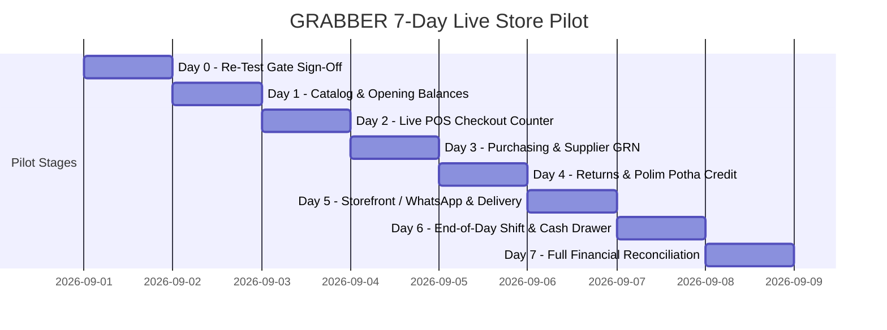

# GRABBER BUSINESS OS — 7-DAY REAL-CLIENT PILOT & ACCEPTANCE PROTOCOL

Battle-tested pilot protocol from automated L3/L4 schema cert + **Ready for Re-Testing** into live store operations.

**Entry criteria:** [`docs/READY_FOR_RETESTING.md`](../READY_FOR_RETESTING.md) P0 = PASS (or CONDITIONAL with listed waivers).  
**Handover pack:** [`CLIENT_DELIVERABLES.md`](../CLIENT_DELIVERABLES.md) · [`SOFTWARE_PLAYBOOK.md`](../SOFTWARE_PLAYBOOK.md) · [`CLAIMS_AND_SCOPE.md`](../CLAIMS_AND_SCOPE.md)

---

## 7-Day Pilot Schedule

Adjust calendar dates per client kickoff; keep sequence.

---

### Day 0: Ready for Re-Testing Sign-Off
* Complete automated + manual P0 in [`READY_FOR_RETESTING.md`](../READY_FOR_RETESTING.md).
* Confirm dual auth: shopper `/` vs staff `/adminpoz` → `/app`.
* Rotate demo PINs/passwords if this instance will hold real data.

### Day 1: Catalog & Opening Balance Ingestion
* Ingest client's verified product spreadsheet via `npm run client:migrate` (or seed + manual SKUs).
* Enter physical opening stock counts per branch and warehouse.
* Import existing customer credit balances (*Polim Potha*) and outstanding supplier AP.
* Run opening trial balance / reports check (`/accounts`, `/api/reports`).

### Day 2: POS Counter & Receipt Printing
* Operate cash and card sales during live store hours (`/pos`).
* Verify thermal receipt printing and barcode scanning (<1s per scan).
* Verify physical stock decrements match items sold.

### Day 3: Purchasing & Supplier GRN Ingestion
* Create a live Purchase Order (`/purchasing`).
* Ingest GRN on arrival; verify stock on-hand increases and Accounts Payable updates.

### Day 4: Customer Credit Sales & Returns
* Credit sale against authorized customer; outstanding balance increases.
* Process repayment on `/polim-potha`; balance reduction + receipt.
* Process return on `/returns`; stock restoration and refund journal.

### Day 5: Storefront, WhatsApp & Delivery
* Shopper places online order on `/` (signed in via `/shop/login`).
* Optional: WhatsApp send path / delivery board dispatch.
* Verify inventory and order visibility for staff.

### Day 6: Shift Close & Drawer Reconciliation
* Cashier closes shift: cash count, card totals, petty cash.
* Z-Report: expected vs counted cash (`/shifts`).

### Day 7: Full Business Reconciliation & Handover
* Compare:
  $$\text{Live Cash + Bank Deposits} \stackrel{?}{=} \text{Total Cash Sales - Expenses - Cash Drops}$$
  $$\text{Stock On Hand} \stackrel{?}{=} \text{Opening + Purchases + Returns - Sales}$$
  $$\text{Accounts Receivable} \stackrel{?}{=} \text{Opening AR + Credit Sales - Repayments}$$
  $$\sum \text{General Ledger Debits} = \sum \text{General Ledger Credits}$$
* **Acceptance Sign-Off:** Client signs the production acceptance sheet once all 4 equations reconcile to 0 unexplained variance.

---

## Sign-off sheet (copy per client)

| Day | Owner | Pass / Fail | Notes |
|-----|-------|-------------|-------|
| 0 | | | |
| 1 | | | |
| 2 | | | |
| 3 | | | |
| 4 | | | |
| 5 | | | |
| 6 | | | |
| 7 | | | |

**Final acceptance:** ☐ Approved for production ☐ Remediation required  
Client: _______________ Date: _______________ Grabber ops: _______________
