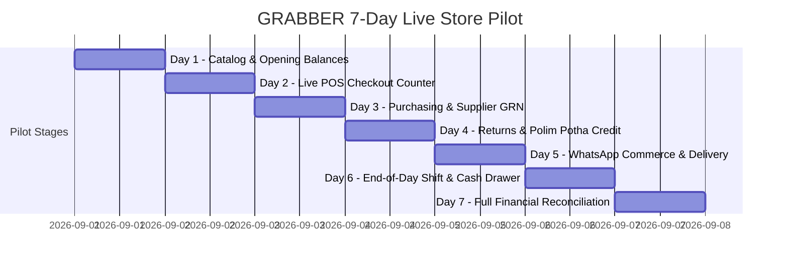

# GRABBER BUSINESS OS — 7-DAY REAL-CLIENT PILOT & ACCEPTANCE PROTOCOL

A battle-tested 7-day pilot protocol to guide the transition from automated L3/L4 certification to live production store operations.

---

## 7-Day Pilot Schedule

---

### Day 1: Catalog & Opening Balance Ingestion
* Ingest client's verified product spreadsheet via `npm run client:migrate`.
* Enter physical opening stock counts per branch and warehouse.
* Import existing customer credit balances (*Polim Potha*) and outstanding supplier AP.
* Run opening trial balance check.

### Day 2: POS Counter & Receipt Printing
* Operate cash and card sales during live store hours.
* Verify 80mm/58mm thermal receipt printing and barcode scanning speed (<1s per scan).
* Verify physical stock decrements match items sold.

### Day 3: Purchasing & Supplier GRN Ingestion
* Create a live Purchase Order to a supplier.
* Ingest Goods Received Note (GRN) on arrival; verify stock on-hand increases and Accounts Payable ledger updates.

### Day 4: Customer Credit Sales & Returns
* Execute credit sale against an authorized customer; verify customer outstanding balance increases.
* Process a customer repayment; verify receipt generation and balance reduction.
* Process an item return; verify stock restoration and refund journal reversal.

### Day 5: WhatsApp Catalog & Order Fulfillment
* Share product cards and payment links via WhatsApp Web / Cloud API.
* Ingest an online delivery order; verify inventory reservation and dispatch note generation.

### Day 6: Shift Close & Drawer Reconciliation
* Cashier completes shift end: records cash count, card terminal totals, and petty cash expenses.
* System produces Z-Report: compares expected cash vs actual counted cash.

### Day 7: Full Business Reconciliation & Handover
* Compare:
  $$\text{Live Cash + Bank Deposits} \stackrel{?}{=} \text{Total Cash Sales - Expenses - Cash Drops}$$
  $$\text{Stock On Hand} \stackrel{?}{=} \text{Opening + Purchases + Returns - Sales}$$
  $$\text{Accounts Receivable} \stackrel{?}{=} \text{Opening AR + Credit Sales - Repayments}$$
  $$\sum \text{General Ledger Debits} = \sum \text{General Ledger Credits}$$
* **Acceptance Sign-Off:** Client signs the production acceptance sheet once all 4 equations reconcile to 0 unexplained variance.
